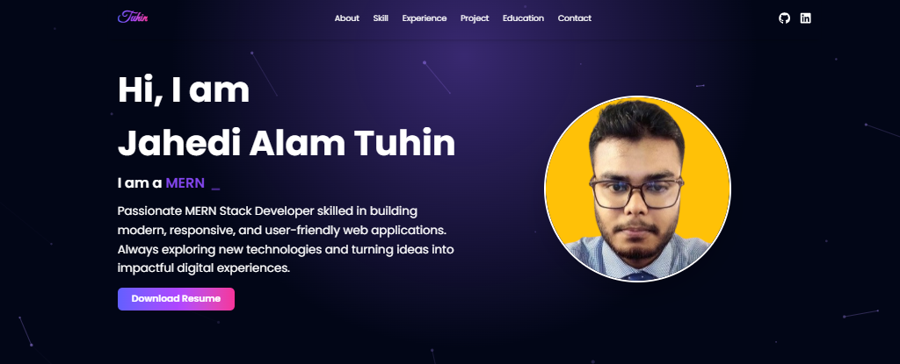

# 🚀 Jahedi Alam Tuhin's Portfolio

[](https://my-portfolio-pi-one-76.vercel.app/)

<div align="center">
  
</div>

## ✨ Features

- **Modern UI** with smooth animations
- **Interactive elements** with 3D tilt effects
- **Particle.js background** for visual appeal
- **Typewriter effect** in hero section
- **Skill visualization** with gauges and progress bars
- **Project showcase** with hover effects
- **Functional contact form** with EmailJS integration

## 🛠 Tech Stack

### Core Technologies


### Key Libraries
```javascript
const tech = {
  animations: ["AOS", "react-parallax-tilt", "react-tsparticles"],
  visualizations: ["react-circular-progressbar", "react-gauge-chart"],
  effects: ["react-simple-typewriter", "react-typing-effect"],
  utilities: ["react-toastify", "react-tooltip", "react-router-dom"]
};
